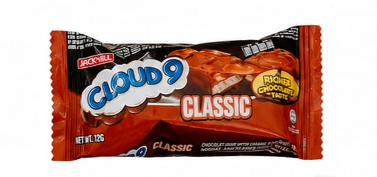
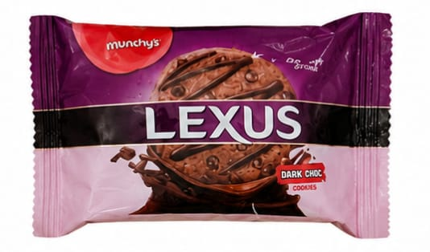
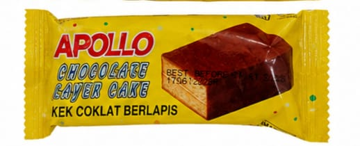

<!DOCTYPE html>
<html lang="en">
<head>
    <meta charset="UTF-8">
    <meta name="viewport" content="width=device-width, initial-scale=1.0">

    <title>Late Night Ramen & Snack</title>

    <style>
        * {
            margin: 0;
            padding: 0;
            box-sizing: border-box;
            font-family: Arial, sans-serif;
        }

        body {
            background: #0b1026;
            color: white;
        }

        /* HEADER */
        header {
            background: linear-gradient(135deg, #111936, #25114d);
            text-align: center;
            padding: 45px 20px;
            border-bottom: 3px solid #ffcc33;
        }

        header h1 {
            font-size: 48px;
            color: #ffd43b;
            text-shadow: 3px 3px #ff477e;
        }

        header p {
            font-size: 18px;
            margin-top: 10px;
            color: #eee;
        }

        /* NAVIGATION */
        nav {
            background: #151d3d;
            text-align: center;
            padding: 15px;
            position: sticky;
            top: 0;
            z-index: 10;
        }

        nav a {
            color: white;
            text-decoration: none;
            margin: 0 15px;
            font-weight: bold;
        }

        nav a:hover {
            color: #ffd43b;
        }

        /* MAIN */
        .container {
            width: 90%;
            max-width: 1100px;
            margin: 40px auto;
        }

        .section-title {
            text-align: center;
            color: #ffd43b;
            font-size: 32px;
            margin-bottom: 30px;
        }

        /* PRODUCTS */
        .products {
            display: grid;
            grid-template-columns: repeat(auto-fit, minmax(220px, 1fr));
            gap: 25px;
        }

        .product {
            background: #171f42;
            border-radius: 18px;
            padding: 20px;
            text-align: center;
            box-shadow: 0 8px 20px rgba(0,0,0,0.4);
            transition: 0.3s;
        }

        .product:hover {
            transform: translateY(-8px);
        }

        .product img {
            width: 100%;
            height: 180px;
            object-fit: contain;
            background: white;
            border-radius: 12px;
            margin-bottom: 15px;
        }

        .product h3 {
            font-size: 21px;
            margin-bottom: 8px;
        }

        .price {
            display: inline-block;
            background: #ffd43b;
            color: #111;
            padding: 8px 15px;
            border-radius: 20px;
            font-size: 20px;
            font-weight: bold;
            margin: 10px 0;
        }

        .buy-btn {
            border: none;
            background: #ff477e;
            color: white;
            padding: 10px 20px;
            border-radius: 20px;
            cursor: pointer;
            font-weight: bold;
        }

        .buy-btn:hover {
            background: #ff245f;
        }

        /* ABOUT */
        .about {
            background: #171f42;
            padding: 30px;
            border-radius: 18px;
            text-align: center;
            line-height: 1.7;
        }

        /* ORDER */
        .order {
            margin-top: 40px;
            background: linear-gradient(135deg, #ff477e, #7b2cff);
            padding: 35px;
            border-radius: 20px;
            text-align: center;
        }

        .order h2 {
            margin-bottom: 10px;
        }

        .order button {
            margin-top: 20px;
            background: #ffd43b;
            color: #111;
            border: none;
            padding: 13px 30px;
            border-radius: 25px;
            font-weight: bold;
            cursor: pointer;
            font-size: 16px;
        }

        /* FOOTER */
        footer {
            text-align: center;
            background: #080c1d;
            padding: 25px;
            margin-top: 50px;
            color: #aaa;
        }

        /* MOBILE */
        @media (max-width: 600px) {
            header h1 {
                font-size: 35px;
            }

            nav a {
                margin: 0 7px;
                font-size: 14px;
            }
        }
    </style>
</head>

<body>

    <!-- HEADER -->
    <header>
        <h1>🌙 Late Night Ramen & Snack 🍜</h1>
        <p>Stay up. Snack up. Enjoy!</p>
    </header>

    <!-- NAVIGATION -->
    <nav>
        <a href="#home">Home</a>
        <a href="#products">Products</a>
        <a href="#about">About</a>
        <a href="#order">Order</a>
    </nav>

    <!-- HOME -->
    <section id="home" class="container">
        <h2 class="section-title">🌙 Late Night Cravings?</h2>

        <div class="about">
            <p>
                Hungry at night? Get your favourite ramen and snacks
                at affordable prices. Perfect for students, movie nights
                and late-night cravings!
            </p>
        </div>
    </section>

    <!-- PRODUCTS -->
    <section id="products" class="container">

        <h2 class="section-title">🍜 Our Products</h2>

        <div class="products">

            <!-- RAMEN 1 -->
            <div class="product">
                
                <h3>Buldak Carbonara</h3>
                <span class="price">RM5.00</span>
                <br>
                <button class="buy-btn" onclick="addToCart('Buldak Carbonara', 5)">
                    Add to Order
                </button>
            </div>

            <!-- RAMEN 2 -->
            <div class="product">
                
                <h3>Buldak Cheese</h3>
                <span class="price">RM5.00</span>
                <br>
                <button class="buy-btn" onclick="addToCart('Buldak Cheese', 5)">
                    Add to Order
                </button>
            </div>

            <!-- CLOUD 9 -->
            <div class="product">
                
                <h3>Cloud 9</h3>
                <span class="price">RM0.50</span>
                <br>
                <button class="buy-btn" onclick="addToCart('Cloud 9', 0.5)">
                    Add to Order
                </button>
            </div>

            <!-- LEXUS -->
            <div class="product">
                
                <h3>Lexus Dark Choc</h3>
                <span class="price">RM1.00</span>
                <br>
                <button class="buy-btn" onclick="addToCart('Lexus', 1)">
                    Add to Order
                </button>
            </div>

            <!-- MAMEE -->
            <div class="product">
                
                <h3>Mamee Monster</h3>
                <span class="price">RM0.50</span>
                <br>
                <button class="buy-btn" onclick="addToCart('Mamee Monster', 0.5)">
                    Add to Order
                </button>
            </div>

            <!-- APOLLO -->
            <div class="product">
                
                <h3>Apollo Chocolate Cake</h3>
                <span class="price">RM0.50</span>
                <br>
                <button class="buy-btn" onclick="addToCart('Apollo Chocolate Cake', 0.5)">
                    Add to Order
                </button>
            </div>

        </div>
    </section>

    <!-- ABOUT -->
    <section id="about" class="container">

        <h2 class="section-title">✨ About Us</h2>

        <div class="about">
            <p>
                Welcome to <b>Late Night Ramen & Snack</b>!
                We provide affordable ramen and snacks for students
                and anyone looking for a quick late-night treat.
            </p>
        </div>

    </section>

    <!-- ORDER -->
    <section id="order" class="container">

        <div class="order">
            <h2>🛒 Your Order</h2>

            <p id="cart">
                No items added yet.
            </p>

            <h3 id="total">
                Total: RM0.00
            </h3>

            <button onclick="checkout()">
                Place Order
            </button>
        </div>

    </section>

    <!-- FOOTER -->
    <footer>
        <p>© 2026 Late Night Ramen & Snack</p>
        <p>Made for late-night cravings 🌙🍜</p>
    </footer>


    <!-- JAVASCRIPT -->
    <script>

        let cart = [];
        let total = 0;

        function addToCart(product, price) {

            cart.push(product);

            total = total + price;

            document.getElementById("cart").innerHTML =
                cart.join("<br>");

            document.getElementById("total").innerHTML =
                "Total: RM" + total.toFixed(2);

            alert(product + " added to your order!");
        }


        function checkout() {

            if (cart.length === 0) {

                alert("Please add a product first!");

            } else {

                alert(
                    "Thank you for your order! 🌙🍜\n\n" +
                    "Total: RM" + total.toFixed(2)
                );

            }

        }

    </script>

<section class="social-media">

    <h2>📱 Follow Us</h2>

    <p>
        Stay updated with our latest ramen, snacks,
        promotions and special offers!
    </p>

    <div class="social-links">

        <!-- FACEBOOK -->
        <a href="https://www.facebook.com/share/1KCdvY2G8D/"
           target="_blank"
           class="facebook">
            👍 Facebook
        </a>

        <!-- INSTAGRAM -->
        <a href="https://www.instagram.com/latenightramennsnacks?stkn=d2VhMHJoZ2l5OTNw"
           target="_blank"
           class="instagram">
            📷 Instagram
        </a>

    </div>

</section>


<!-- ============================= -->
<!-- SOCIAL MEDIA STYLE -->
<!-- ============================= -->

<style>

    .social-media {
        width: 90%;
        max-width: 800px;
        margin: 50px auto;
        padding: 35px 20px;
        text-align: center;

        background: #171f42;
        border-radius: 20px;

        box-shadow: 0 8px 20px rgba(0, 0, 0, 0.4);
    }


    .social-media h2 {
        color: #ffd43b;
        font-size: 30px;
        margin-bottom: 12px;
    }


    .social-media p {
        color: #dddddd;
        font-size: 16px;
        margin-bottom: 25px;
        line-height: 1.6;
    }


    .social-links {
        display: flex;
        justify-content: center;
        align-items: center;
        gap: 20px;

        flex-wrap: wrap;
    }


    .social-links a {
        text-decoration: none;
        color: white;

        padding: 13px 25px;

        border-radius: 30px;

        font-size: 17px;
        font-weight: bold;

        transition: 0.3s;
    }


    /* FACEBOOK */

    .facebook {
        background: #1877f2;
    }


    /* INSTAGRAM */

    .instagram {
        background: linear-gradient(
```


</body>
</html>
